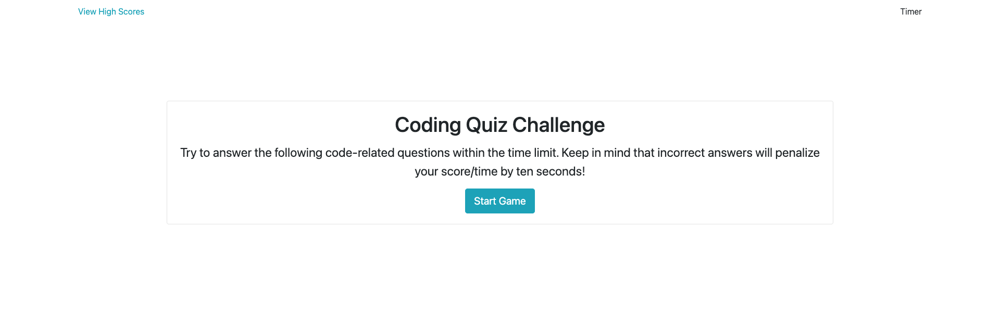
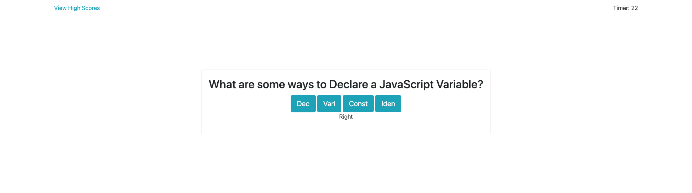
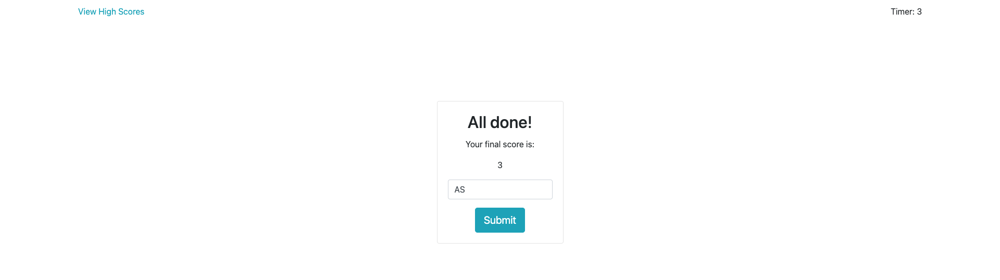

# Module-4-Challenge

## Description

This project allowed me to continue exploring logical problem solving skills. I was motivated to make this application run smoothly for great UI experience. I plan on adding more questions to this quiz in order to test the skills of my colleagues and I on JavaScript. In the meantime, the functionally is completely built out and deployed for users to test their JavaScript knowledge.

## Deployed Website

The following is are screenshots and the url of the deployed website: 

- https://albertosuarez8.github.io/Module-4-Challenge/
